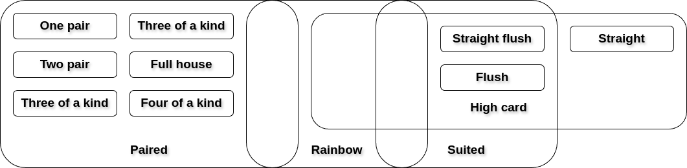

Hand Evaluation
===============

Not every poker software involves game simulations. Beyond its use of providing a simulated poker environment, PokerKit serves as a valuable resource for evaluating poker hands. It supports the largest selection of hand types in any mainstream open-source poker library. This makes it an invaluable tool for users interested in studying the statistical properties of poker, regardless of their interest in game simulations.

The following is the list of hand types supported by PokerKit.

+-----------------------------+---------------------------------------------------+-------------------------------------------------+
| **Hand Type**               | **Class**                                         | **Lookup**                                      |
+-----------------------------+---------------------------------------------------+-------------------------------------------------+
| Standard high hands         | :class:`pokerkit.hands.StandardHighHand`          | :class:`pokerkit.lookups.StandardLookup`        |
+-----------------------------+---------------------------------------------------+                                                 |
| Standard low hands          | :class:`pokerkit.hands.StandardLowHand`           |                                                 |
+-----------------------------+---------------------------------------------------+                                                 |
| Greek hold'em hands         | :class:`pokerkit.hands.GreekHoldemHand`           |                                                 |
+-----------------------------+---------------------------------------------------+                                                 |
| Omaha hold'em hands         | :class:`pokerkit.hands.OmahaHoldemHand`           |                                                 |
+-----------------------------+---------------------------------------------------+-------------------------------------------------+
| 8 or better low hands       | :class:`pokerkit.hands.EightOrBetterLowHand`      | :class:`pokerkit.lookups.EightOrBetterLookup`   |
+-----------------------------+---------------------------------------------------+                                                 |
| Omaha 8 or better low hands | :class:`pokerkit.hands.OmahaEightOrBetterLowHand` |                                                 |
+-----------------------------+---------------------------------------------------+-------------------------------------------------+
| Short-deck hold'em hands    | :class:`pokerkit.hands.ShortDeckHoldemHand`       | :class:`pokerkit.lookups.ShortDeckHoldemLookup` |
+-----------------------------+---------------------------------------------------+-------------------------------------------------+
| Regular low hands           | :class:`pokerkit.hands.RegularLowHand`            | :class:`pokerkit.lookups.RegularLookup`         |
+-----------------------------+---------------------------------------------------+-------------------------------------------------+
| Badugi hands                | :class:`pokerkit.hands.BadugiHand`                | :class:`pokerkit.lookups.BadugiLookup`          |
+-----------------------------+---------------------------------------------------+-------------------------------------------------+
| Standard badugi hands       | :class:`pokerkit.hands.StandardBadugiHand`        | :class:`pokerkit.lookups.StandardBadugiLookup`  |
+-----------------------------+---------------------------------------------------+-------------------------------------------------+

Some of these types share the same base lookup. They just differ in the way the hands are evaluated. For example, standard high hands and Omaha hold'em hands use the same lookup.

Typically, when a hand name contains the term ``low``, it means it is a low hand.

Benchmarks
----------

The benchmark of the hand evaluation suite for the standard hand on a single core of Intel Core i7-1255U with 16GB of RAM and Python 3.11.5 is shown in the below table.

================= ========= =========
Metric            PokerKit  Treys
================= ========= =========
Speed (# hands/s) 1016740.7 3230966.4
================= ========= =========

PokerKit performs in the same magnitude as ``treys``. But, it is a bit faster. This is an inevitable consequence of having a generalized high-level interface for evaluating hands. If speed is paramount, the user is recommended to explore various C++ solutions such as ``OMPEval``.

Representing Cards
------------------

In order to evaluate hands, one must understand how to represent cards in PokerKit. There are multiple ways these can be represented. The below statements define an identical set of cards.

.. code-block:: python

   from pokerkit import *

   cards = Card(Rank.ACE, Suit.SPADE), Card(Rank.KING, Suit.SPADE)
   cards = [Card(Rank.ACE, Suit.SPADE), Card(Rank.KING, Suit.SPADE)]
   cards = {Card(Rank.ACE, Suit.SPADE), Card(Rank.KING, Suit.SPADE)}
   cards = Card.parse('AsKs')
   cards = 'AsKs'

String Representations
^^^^^^^^^^^^^^^^^^^^^^

All functions and methods in PokerKit that accept cards also accept strings that represent cards. A single card as a string is composed of two characters: a rank and a suit, the valid values of each are shown in the below tables. A single string can contain multiple card representations.

======= ========= =======================================
Rank    Character Class
======= ========= =======================================
Ace     A         :attr:`pokerkit.utilities.Rank.ACE`
Deuce   2         :attr:`pokerkit.utilities.Rank.DEUCE`
Trey    3         :attr:`pokerkit.utilities.Rank.TREY`
Four    4         :attr:`pokerkit.utilities.Rank.FOUR`
Five    5         :attr:`pokerkit.utilities.Rank.FIVE`
Six     6         :attr:`pokerkit.utilities.Rank.SIX`
Seven   7         :attr:`pokerkit.utilities.Rank.SEVEN`
Eight   8         :attr:`pokerkit.utilities.Rank.EIGHT`
Nine    9         :attr:`pokerkit.utilities.Rank.NINE`
Ten     T         :attr:`pokerkit.utilities.Rank.TEN`
Jack    J         :attr:`pokerkit.utilities.Rank.JACK`
Queen   Q         :attr:`pokerkit.utilities.Rank.QUEEN`
King    K         :attr:`pokerkit.utilities.Rank.KING`
Unknown ?         :attr:`pokerkit.utilities.Rank.UNKNOWN`
======= ========= =======================================

======= ========= ======================================
Suit    Character Class
======= ========= ======================================
Club    c         :attr:`pokerkit.utilities.Suit.CLUB`
Diamond d         :attr:`pokerkit.utilities.Suit.DIAMOND`
Heart   h         :attr:`pokerkit.utilities.Suit.HEART`
Spade   s         :attr:`pokerkit.utilities.Suit.SPADE`
Unknown ?         :attr:`pokerkit.utilities.Suit.UNKNOWN`
======= ========= ======================================

Note that **parsing the strings is computationally expensive**. Therefore, **if performance is key, one should parse it beforehand and avoid using raw strings as cards**. The parsing can be facilitated with :meth:`pokerkit.utilities.Card.parse`.

.. code-block:: pycon

   >>> Card.parse('AsKsQsJsTs')  # doctest: +ELLIPSIS
   <generator object Card.parse at 0x...>
   >>> list(Card.parse('2c8d5sKh'))
   [2c, 8d, 5s, Kh]
   >>> next(Card.parse('AcAh'))
   Ac
   >>> tuple(Card.parse('??2?3??c'))
   (??, 2?, 3?, ?c)

Unknowns
^^^^^^^^

PokerKit allow cards to contain an unknown value. If a rank and/or suit are unknown, they can be represented as a question mark character (``"?"``). Note that these values are not treated as jokers in the hand evaluation suite, but instead are ignored/complained about by them. Unknown cards are intended to be used during game simulation when some hole card values might not be known.

Creating Hands
--------------

There are two ways of creating hands. They are both very straightforward.

The first method is simply by giving the cards that make up a hand.

.. code-block:: pycon

   >>> from pokerkit import *
   >>> h0 = ShortDeckHoldemHand('6s7s8s9sTs')
   >>> h1 = ShortDeckHoldemHand('7c8c9cTcJc')
   >>> h2 = ShortDeckHoldemHand('2c2d2h2s3h')
   Traceback (most recent call last):
       ...
   ValueError: invalid hand '2c2d2h2s3h'
   >>> h0
   6s7s8s9sTs
   >>> h1
   7c8c9cTcJc

The second method is useful in game scenarios where you put in the user's hole cards and the board cards (maybe empty).

.. code-block:: pycon

   >>> from pokerkit import *
   >>> h0 = OmahaHoldemHand.from_game('6c7c8c9c', '8s9sTc')
   >>> h1 = OmahaHoldemHand('6c7c8s9sTc')
   >>> h0 == h1
   True
   >>> h0 = OmahaEightOrBetterLowHand.from_game('As2s3s4s', '2c3c4c5c6c')
   >>> h1 = OmahaEightOrBetterLowHand('Ad2d3d4d5d')
   >>> h0 == h1
   True
   >>> hole = 'AsAc'
   >>> board = 'Kh3sAdAh'
   >>> hand = StandardHighHand.from_game(hole, board)
   >>> hand.cards
   (As, Ac, Kh, Ad, Ah)

Comparing Hands
---------------

Let us define what the "strength" of a hand means. The strength decides who wins the pot and who loses the pot. Realize that stronger or weaker hands do not necessarily always mean higher or lower hands. For instance, in some variants, lower hands are considered stronger, and vice versa.

PokerKit's hand comparison interface allows hand strengths to be compared using standard comparison operators.

.. code-block:: pycon

   >>> from pokerkit import *
   >>> h0 = StandardHighHand('7c5d4h3s2c')
   >>> h1 = StandardHighHand('7c6d4h3s2c')
   >>> h2 = StandardHighHand('8c7d6h4s2c')
   >>> h3 = StandardHighHand('AcAsAd2s4s')
   >>> h4 = StandardHighHand('TsJsQsKsAs')
   >>> h0 < h1 < h2 < h3 < h4
   True

.. code-block:: pycon

   >>> from pokerkit import *
   >>> h0 = StandardLowHand('TsJsQsKsAs')
   >>> h1 = StandardLowHand('AcAsAd2s4s')
   >>> h2 = StandardLowHand('8c7d6h4s2c')
   >>> h3 = StandardLowHand('7c6d4h3s2c')
   >>> h4 = StandardLowHand('7c5d4h3s2c')
   >>> h0 < h1 < h2 < h3 < h4
   True

Custom Hands
------------

The library generates a lookup table for each hand type. The hands are generated in the order or reverse order of strength and assigned indices, which are used to compare hands. High-level interfaces allow users to construct hands by passing in the necessary cards and using standard comparison operators to compare the hand strengths. Each hand type in PokerKit handles this distinction internally, making it transparent to the end user.

If the user wishes to define custom hand types, they can leverage existing lookups or create an entirely new lookup table from which hand types are derived. :mod:`pokerkit.lookups` and :mod:`pokerkit.hands` contain plenty of examples of this that the user can take inspiration from.

Algorithm
---------

In the lookup construction process, cards are converted into unique integers that represent their ranks. Each rank corresponds to a unique prime number and the converted integers are multiplied together. The suitedness of the cards is then checked.  Using the product and the suitedness, the library looks for the matching hand entries which are then used to compare hands.

This approach was used by the ``deuces`` and ``treys`` hand evaluation libraries.
