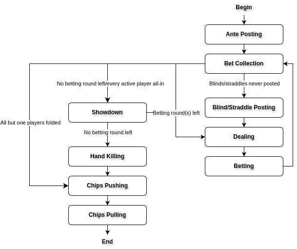
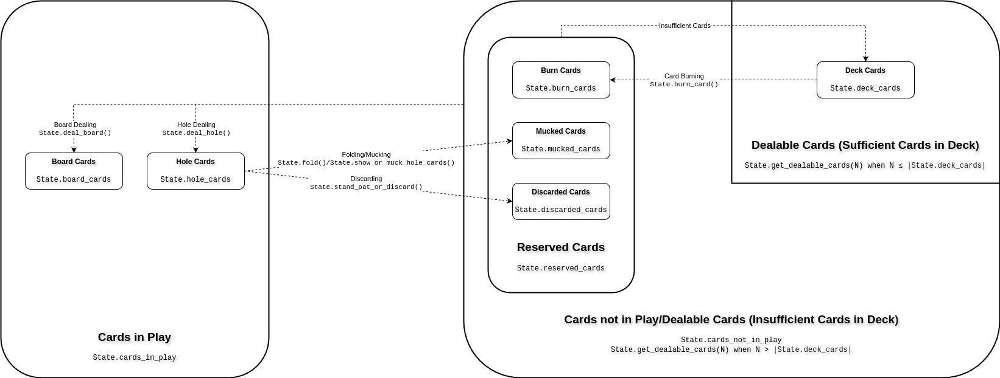

Game Simulation
===============

PokerKit provides tools for poker game simulations. Its customizability allows users to define and utilize almost every poker variant that exists.

Each poker variant often introduces unique game rules and hand types not seen in other variants. The versatility of PokerKit allows for the customization of poker variants, allowing users to define their own unique games, adapt an existing variant, or implement a variant not currently supported by PokerKit out of the box. This flexibility is achieved without compromising the robustness of the implementation, backed by extensive unit tests and doctests to ensure error-free operations. Naturally, common variants are already defined out of the box, so, for most use cases, users will not have to define their own variants.

PokerKit stands out with its ability to cater to an assortment of use cases, offering varying degrees of control over the game state. For instance, in use cases for poker AI agent development, where the agents' focus lies primarily in action selection during betting rounds, minute details such as showdown order, posting blinds, posting antes, and bet collection may not be pertinent. On the other hand, an online poker casino requires granular control over each game aspect. These include dealing hole cards one by one, burning cards, deciding to muck or show during the showdown (even when unnecessary), killing hands after the showdown, pushing chips to the winner's stack, and even the winner collecting the chips into their stack. Depending on the use case, PokerKit provides users with varying levels of automation tailored to their specific needs.

Initialization
--------------

There are two ways the user can initialize a poker state to simulate them. The first method involves using pre-defined games from which the user just needs to specify the initial chip configurations. The second method involves defining every parameter such that all the various aspects of poker games such as the variant and the initial chip configurations.

Pre-Defined Games
^^^^^^^^^^^^^^^^^

PokerKit offers virtually unlimited poker variants to be played. However, defining poker variants can be quite an overwhelming task for a new user due the sheer number and complexities of the state parameters. Therefore, PokerKit offers pre-defined poker variants where the user can just supply a more intuitive subset of arguments such as antes, blinds, starting stacks, et cetera, which are as follows:

============================================================ ========================================================================
Variant                                                      Class
============================================================ ========================================================================
Fixed-limit badugi                                           :class:`pokerkit.games.FixedLimitBadugi`
Fixed-limit deuce-to-seven lowball triple draw               :class:`pokerkit.games.FixedLimitDeuceToSevenLowballTripleDraw`
Fixed-limit Omaha hold'em hi-low split-eight or better low   :class:`pokerkit.games.FixedLimitOmahaHoldemHighLowSplitEightOrBetter`
Fixed-limit razz                                             :class:`pokerkit.games.FixedLimitRazz`
Fixed-limit seven card stud                                  :class:`pokerkit.games.FixedLimitSevenCardStud`
Fixed-limit seven card stud hi-low split-eight or better low :class:`pokerkit.games.FixedLimitSevenCardStudHighLowSplitEightOrBetter`
Fixed-limit Texas hold'em                                    :class:`pokerkit.games.FixedLimitTexasHoldem`
No-limit deuce-to-seven single draw                          :class:`pokerkit.games.NoLimitDeuceToSevenLowballSingleDraw`
No-limit short-deck hold'em                                  :class:`pokerkit.games.NoLimitShortDeckHoldem`
No-limit Texas hold'em                                       :class:`pokerkit.games.NoLimitTexasHoldem`
Pot-limit Omaha hold'em                                      :class:`pokerkit.games.PotLimitOmahaHoldem`
============================================================ ========================================================================

These pre-defined games can be created as shown below:

.. code-block:: python

   from pokerkit import (
        Automation,
        FixedLimitDeuceToSevenLowballTripleDraw,
        NoLimitTexasHoldem,
   )

   state = FixedLimitDeuceToSevenLowballTripleDraw.create_state(
       # automations
       (
           Automation.ANTE_POSTING,
           Automation.BET_COLLECTION,
           Automation.BLIND_OR_STRADDLE_POSTING,
           Automation.CARD_BURNING,
           Automation.HOLE_CARDS_SHOWING_OR_MUCKING,
           Automation.HAND_KILLING,
           Automation.CHIPS_PUSHING,
           Automation.CHIPS_PULLING,
       ),
       True,  # False for big blind ante, True otherwise
       0,  # ante
       (75000, 150000),  # blinds or straddles
       150000,  # small bet
       300000,  # big bet
       (1180000, 4340000, 5910000, 10765000),  # starting stacks
       4,  # number of players
   )

   state = NoLimitTexasHoldem.create_state(
       # automations
       (
           Automation.ANTE_POSTING,
           Automation.BET_COLLECTION,
           Automation.BLIND_OR_STRADDLE_POSTING,
           Automation.CARD_BURNING,
           Automation.HOLE_CARDS_SHOWING_OR_MUCKING,
           Automation.HAND_KILLING,
           Automation.CHIPS_PUSHING,
           Automation.CHIPS_PULLING,
       ),
       True,  # False for big blind ante, True otherwise
       500,  # ante
       (1000, 2000),  # blinds or straddles
       2000,  # min bet
       (1125600, 2000000, 553500),  # starting stacks
       3,  # number of players
   )

In certain use cases, one may want to create a template from which just the starting stacks and the number of players can be specified. In PokerKit, this can be done by creating an instance of the game that acts as a state factory from which states are initialized. The code below, doing exactly that, is equivalent to the previous code.

.. code-block:: python

   from pokerkit import (
        Automation,
        FixedLimitDeuceToSevenLowballTripleDraw,
        NoLimitTexasHoldem,
   )

   game = FixedLimitDeuceToSevenLowballTripleDraw(
       # automations
       (
           Automation.ANTE_POSTING,
           Automation.BET_COLLECTION,
           Automation.BLIND_OR_STRADDLE_POSTING,
           Automation.CARD_BURNING,
           Automation.HOLE_CARDS_SHOWING_OR_MUCKING,
           Automation.HAND_KILLING,
           Automation.CHIPS_PUSHING,
           Automation.CHIPS_PULLING,
       ),
       True,  # False for big blind ante, True otherwise
       0,  # ante
       (75000, 150000),  # blinds or straddles
       150000,  # small bet
       300000,  # big bet
   )
   state = game(
       (1180000, 4340000, 5910000, 10765000),  # starting stacks
       4,  # number of players
   )

   game = NoLimitTexasHoldem(
       # automations
       (
           Automation.ANTE_POSTING,
           Automation.BET_COLLECTION,
           Automation.BLIND_OR_STRADDLE_POSTING,
           Automation.CARD_BURNING,
           Automation.HOLE_CARDS_SHOWING_OR_MUCKING,
           Automation.HAND_KILLING,
           Automation.CHIPS_PUSHING,
           Automation.CHIPS_PULLING,
       ),
       True,  # False for big blind ante, True otherwise
       500,  # ante
       (1000, 2000),  # blinds or straddles
       2000,  # min bet
   )
   state = game(
       (1125600, 2000000, 553500),  # starting stacks
       3,  # number of players
   )

The exact parameters that must be specified differ depending on the variant being played. Button games accept antes and blinds/straddles. Stud games accept bring-ins. Fixed-limit games accept small/big bets while pot/no-limit games accept a min-bet. For a specific list of parameters, the API references should be consulted.

Why Specify the Number of Players?
^^^^^^^^^^^^^^^^^^^^^^^^^^^^^^^^^^

The ways the chip values (e.g. antes, blinds/straddles, and starting stacks) can be supplied in PokerKit are quite liberal. For instance, the statements below are identical.

.. code-block:: python

   state = game(
       (200, 200, 200, 200),  # starting stacks
       4,  # number of players
   )
   state = game(
       [200, 200, 200, 200],  # starting stacks
       4,  # number of players
   )
   state = game(
       {0: 200, 1: 200, 2: 200, 3: 200},  # starting stacks
       4,  # number of players
   )
   state = game(
       200,  # starting stacks
       4,  # number of players
   )

In the fourth statement, PokerKit interprets a single numeric value for the starting stacks parameter as saying identical values for all players. Since just a single number does not say anything about the number of players like a ``list``, ``tuple``, or ``dict`` (sometimes), the number of players must also be supplied.

Defining States from Scratch
^^^^^^^^^^^^^^^^^^^^^^^^^^^^

If you want to create a state of a variant not listed above, you will have to define a custom variant. A variant is composed of the following definitions:

+-----------------------------------------+----------------------------------------------------------------------------------------------------------------------------+
+ **Definition**                          | **Description**                                                                                                            |
+-----------------------------------------+----------------------------------------------------------------------------------------------------------------------------+
| Deck                                    | Deck used in the game. Please note that most variants use a 52-card deck.                                                  |
+-----------------------------------------+----------------------------------------------------------------------------------------------------------------------------+
| Hand Types                              | Hand types. Most variants use one, but split-pot games use two. No poker variants use three or more.                       |
+---------+-------------------------------+----------------------------------------------------------------------------------------------------------------------------+
| Streets | Card Burning Status           | Whether or not to burn a card, should be ``True`` to burn, otherwise ``False``.                                            |
|         +-------------------------------+----------------------------------------------------------------------------------------------------------------------------+
|         | Hole Dealings                 | Whether or not and how to deal hole cards (face-up/down), should be an empty tuple for none.                               |
|         +-------------------------------+----------------------------------------------------------------------------------------------------------------------------+
|         | Board Dealings                | How many board cards to deal, if at all, should be zero for none.                                                          |
|         +-------------------------------+----------------------------------------------------------------------------------------------------------------------------+
|         | Is Draw Stage                 | Whether it is a draw round, should be ``True`` to draw, otherwise ``False``.                                               |
|         +-------------------------------+----------------------------------------------------------------------------------------------------------------------------+
|         | Opening                       | How to decide who acts first. Typically, in button games, it's by position. In stud games, lowest/highest up card or hand. |
|         +-------------------------------+----------------------------------------------------------------------------------------------------------------------------+
|         | Min Completion/Bet/Raise      | Minimum completion/bet/raise size.                                                                                         |
|         +-------------------------------+----------------------------------------------------------------------------------------------------------------------------+
|         | Max # of Completion/Bet/Raise | Maximum number of completions/bets/raises, should be ``None`` for unlimited.                                               |
+---------+-------------------------------+----------------------------------------------------------------------------------------------------------------------------+
| Betting Structure                       | Betting limits such as no-limit, pot-limit, or fixed-limit.                                                                |
+-----------------------------------------+----------------------------------------------------------------------------------------------------------------------------+

In addition to the above parameters that define the variant, more parameters are required to be specified to initialize a state.

+-----------------------------------------+----------------------------------------------------------------------------------------------------------------------------+
| Ante Trimming Status                    | Simply put, ``True`` if uniform antes, ``False`` if Non-uniform antes (BB ante, BTN ante, etc.)                            |
+-----------------------------------------+----------------------------------------------------------------------------------------------------------------------------+
| Antes                                   | Antes, should be zero for none.                                                                                            |
+-----------------------------------------+----------------------------------------------------------------------------------------------------------------------------+
| Blinds/Straddles                        | Forced bets like blinds/straddles, should be zero(s) for stud games.                                                       |
+-----------------------------------------+----------------------------------------------------------------------------------------------------------------------------+
| Bring-in                                | Bring-in, should be zero for non-stud games.                                                                               |
+-----------------------------------------+----------------------------------------------------------------------------------------------------------------------------+
| Starting Stacks                         | Starting stacks.                                                                                                           |
+-----------------------------------------+----------------------------------------------------------------------------------------------------------------------------+
| Number of Players                       | Number of players.                                                                                                         |
+-----------------------------------------+----------------------------------------------------------------------------------------------------------------------------+

For the full list of parameters, please see the API references of :class:`pokerkit.state.State`.

The below definition shows a definition of a Kuhn poker state:

.. code-block:: python

   from pokerkit import (
        Automation,
        BettingStructure,
        Deck,
        KuhnPokerHand,
        Opening,
        State,
        Street,
   )

   state = State(
       # automations
       (
           Automation.ANTE_POSTING,
           Automation.BET_COLLECTION,
           Automation.BLIND_OR_STRADDLE_POSTING,
           Automation.CARD_BURNING,
           Automation.HOLE_DEALING,
           Automation.BOARD_DEALING,
           Automation.HOLE_CARDS_SHOWING_OR_MUCKING,
           Automation.HAND_KILLING,
           Automation.CHIPS_PUSHING,
           Automation.CHIPS_PULLING,
       ),
       Deck.KUHN_POKER,  # deck
       (KuhnPokerHand,),  # hand types (high/low-split will have two types)
       # streets
       (
           Street(
               False,  # card burning
               (False,),  # hole card dealing statuses (False for face-down)
               0,  # board dealing count
               False,  # standing pat or discarding
               Opening.POSITION,  # who opens the betting?
               1,  # min bet
               None,  # maximum number of completions/bettings/raisings
           ),
       ),
       BettingStructure.FIXED_LIMIT,  # betting structure
       True,  # ``False`` for big blind ante, otherwise ``True``
       (1,) * 2,  # ante
       (0,) * 2,  # blind or straddles
       0,  # bring-in
       (2,) * 2,  # starting stacks
       2,  # number of players
   )

If you would like to see other variants pre-defined, please create an issue in the project's repository or contact the library authors.

What Is Ante Trimming Status?
^^^^^^^^^^^^^^^^^^^^^^^^^^^^^

To unambiguously define the ante configuration, this value is necessary. It means the following: say players ended up paying different ante amounts at the start of the game; if the player who put less ante wins, is the player entitled to win the full antes of others that put more? This means that this parameter is only relevant when different ante amounts is paid by the players. This situation arises in two different situations: when non-uniform antes like BB or BTN ante (used in tournaments or 6+ poker) are used or when a player has a very low starting stack that falls below the ante amount. If the answer to this question is yes, ``False`` must be supplied, or, if no, the supplied value must be ``True``.

Simply put, if non-uniform antes are used, ``False`` must be supplied no matter what. If uniform antes are used, the programmer has a choice, but the value supplied should most likely be ``True`` unless the programmer believes that the player who is short-stacked to the point of not being able to post the full ante can win the full antes of others as opposed to just a portion of it.

Position
^^^^^^^^

Note that PokerKit does not consider "seat numbers" but instead "positions" that are relevant to the gameplay. For non-heads-up button games, this means that the zeroth player will always be the small blind, the first player will always be the big blind, the second player will always be UTG, and so on until the last player who will always be in the button and in position. The notion of position does not really exist in stud games. In this case, the player to the immediate left of the dealer should be in the zeroth position while the player to the immediate right of the dealer should be in the last position.

Note that, in this ordering, the player in the n'th position is the n'th person to be dealt the hole cards at the beginning of the hand.

Automation
^^^^^^^^^^

The PokerKit state allows the state to be modified in a really fine-grained way, down to posting antes, blinds, straddles, burning cards before dealing, dealing hole cards, dealing board cards, standing pat, discarding, folding, checking, calling, posting bring-ins, completing, betting, raising, showing hole cards, mucking, dealer killing losing hands, collecting bets, pushing chips to the winners, and winners putting the chips they won back into their stack.

This fine-grained state transition is necessary for use in online casinos. However, depending on the use cases, many of these operations are completely irrelevant and can be automatically handled without any user input, as users can specify which operations they care about and therefore be manual, as opposed to being automated.

For example, if you are trying to create a poker AI, you are not worried about having the option of mucking the best hand, purposely showing the worst hand, burning a card, pushing the chips to the winners, collecting chips a player won, collecting bets after each street, et cetera. But, you want to handle user actions like fold, check, call, bring-in, complete, bet, and raise. Also, you might want to control what cards are dealt to each player and to the board. The below automations will suit the aforesaid use cases.

.. code-block:: python

   from pokerkit import Automation

   # Automate everything except player actions.
   # Manual:
   #   - Standing pat
   #   - Discarding
   #   - Folding
   #   - Checking
   #   - Calling
   #   - Posting bring-in
   #   - Completing
   #   - Betting
   #   - Raising
   automations = (
       Automation.ANTE_POSTING,
       Automation.BET_COLLECTION,
       Automation.BLIND_OR_STRADDLE_POSTING,
       Automation.CARD_BURNING,
       Automation.HOLE_DEALING,
       Automation.BOARD_DEALING,
       Automation.HOLE_CARDS_SHOWING_OR_MUCKING,
       Automation.HAND_KILLING,
       Automation.CHIPS_PUSHING,
       Automation.CHIPS_PULLING,
   )

   # Automate everything except player actions and dealings.
   # Manual:
   #   - Player:
   #     - Standing pat
   #     - Discarding
   #     - Folding
   #     - Checking
   #     - Calling
   #     - Posting bring-in
   #     - Completing
   #     - Betting
   #     - Raising
   #   - Dealer:
   #     - Deal hole cards
   #     - Deal board cards
   automations = (
       Automation.ANTE_POSTING,
       Automation.BET_COLLECTION,
       Automation.BLIND_OR_STRADDLE_POSTING,
       Automation.CARD_BURNING,
       Automation.HOLE_CARDS_SHOWING_OR_MUCKING,
       Automation.HAND_KILLING,
       Automation.CHIPS_PUSHING,
       Automation.CHIPS_PULLING,
   )

However, if you are trying to create an online poker room, you need to represent all these fine changes to create a smooth user experience. In such a case, nothing must be automated, as below.

.. code-block:: python

   from pokerkit import Automation

   # Automate nothing.
   # Manual:
   # - Player:
   #   - Ante posting
   #   - Blind/straddle posting
   #   - Standing pat
   #   - Discarding
   #   - Folding
   #   - Checking
   #   - Calling
   #   - Posting bring-in
   #   - Completing
   #   - Betting
   #   - Raising
   #   - Showdown (show/muck)
   #   - Incorporating won chips into the stack
   # - Dealer:
   #   - Bet collection
   #   - Card burning
   #   - Deal hole cards
   #   - Deal board cards
   #   - Killing losing hands
   #   - Distributing chips
   automations = ()

Even if you are trying to use this for video poker and you are happy with PokerKit dealing cards at random (hopefully), you should still pass an empty automation as this parameter. This is because the dealing of each card is still a change in the state and therefore you might want to represent the state changing as each card is dealt.

.. code-block:: python

   # Automate nothing (control even what cards are dealt)
   automations = ()

:class:`pokerkit.state.Automation` describes a complete list of operations that can be automated.

Deck
^^^^

When you supply a deck to the state, the state automatically shuffles it so the cards can be dealt at random when required. :class:`pokerkit.utilities.Deck` describes a complete list of decks. Decks are simply tuples of cards and you can define your own as needed.

Most poker games use a standard 52-card deck, accessible as :class:`pokerkit.utilities.Deck.STANDARD` or :class:`pokerkit.utilities.Deck.REGULAR`. Both are composed of 52 cards and have no difference in content. The only difference between the two is that they are sorted differently. The standard deck uses the ace-high rank ordering while the regular deck has ace-low rank ordering. Obviously, after shuffling, there is no real difference. Simply choose whatever you prefer. In pre-defined games within PokerKit, regular decks are only used for variants that always consider aces to low.

Hand Types
^^^^^^^^^^

Hand types denote how hands are evaluated in a game setting. Most games like Texas hold 'em or short-deck use just one hand type, but some games like high-low split games use two hand types. Technically, you can define more than two in PokerKit, but no mainstream variant uses more than two.

.. code-block:: python

   from pokerkit import *

   # Texas hold'em, et cetera
   hand_types = (StandardHighHand,)

   # Omaha hold'em Hi-lo split 8-or-better
   hand_types = OmahaHoldemHand, OmahaEightOrBetterLowHand

Hand types are defined in :mod:`pokerkit.hands`.

Streets
^^^^^^^

Streets describe each betting round and the dealing(s) before it. When you define a street, internal checks are carried out to make sure the definition is sound. Examples of streets for selections of variants are shown below:

.. code-block:: python

   from pokerkit import *

   # No-limit Texas hold'em
   streets = (
       Street(
           card_burning_status=False,
           hole_dealing_statuses=(False, False),
           board_dealing_count=0,
           draw_status=False,
           opening=Opening.POSITION,
           min_completion_betting_or_raising_amount=2,
           max_completion_betting_or_raising_count=None,
       ),
       Street(
           card_burning_status=True,
           hole_dealing_statuses=(),
           board_dealing_count=3,
           draw_status=False,
           opening=Opening.POSITION,
           min_completion_betting_or_raising_amount=2,
           max_completion_betting_or_raising_count=None,
       ),
       Street(
           card_burning_status=True,
           hole_dealing_statuses=(),
           board_dealing_count=1,
           draw_status=False,
           opening=Opening.POSITION,
           min_completion_betting_or_raising_amount=2,
           max_completion_betting_or_raising_count=None,
       ),
       Street(
           card_burning_status=True,
           hole_dealing_statuses=(),
           board_dealing_count=1,
           draw_status=False,
           opening=Opening.POSITION,
           min_completion_betting_or_raising_amount=2,
           max_completion_betting_or_raising_count=None,
       ),
   )

   # Fixed-limit razz
   streets = (
       Street(
           card_burning_status=False,
           hole_dealing_statuses=(False, False, True),
           board_dealing_count=0,
           draw_status=False,
           opening=Opening.HIGH_CARD,
           min_completion_betting_or_raising_amount=2,
           max_completion_betting_or_raising_count=4,
       ),
       Street(
           card_burning_status=True,
           hole_dealing_statuses=(True,),
           board_dealing_count=0,
           draw_status=False,
           opening=Opening.LOW_HAND,
           min_completion_betting_or_raising_amount=2,
           max_completion_betting_or_raising_count=4,
       ),
       Street(
           card_burning_status=True,
           hole_dealing_statuses=(True,),
           board_dealing_count=0,
           draw_status=False,
           opening=Opening.LOW_HAND,
           min_completion_betting_or_raising_amount=4,
           max_completion_betting_or_raising_count=4,
       ),
       Street(
           card_burning_status=True,
           hole_dealing_statuses=(True,),
           board_dealing_count=0,
           draw_status=False,
           opening=Opening.LOW_HAND,
           min_completion_betting_or_raising_amount=4,
           max_completion_betting_or_raising_count=4,
       ),
       Street(
           card_burning_status=True,
           hole_dealing_statuses=(False,),
           board_dealing_count=0,
           draw_status=False,
           opening=Opening.LOW_HAND,
           min_completion_betting_or_raising_amount=4,
           max_completion_betting_or_raising_count=4,
       ),
   )

Card Burning
""""""""""""

You might want to burn cards before any cards are dealt such as when dealing flops, turns, or rivers in Texas hold'em, or before dealing hole cards after drawing in draw games (``True`` if this is so).

Hole Card Dealing Statuses
""""""""""""""""""""""""""

Most poker variants deal cards face down, but this is not the case for stud games. In seven card stud, cards are dealt "down down up", "up", "up", "up", and, finally, "down" (up is ``True`` and down is ``False``). This parameter allows the user to specify how to deal with hole cards (an empty tuple if none). Of course, this means the length of this argument is equal to the number of hole cards dealt for that street to each active player.

Board Dealing Count
"""""""""""""""""""

This parameter denotes how many board cards are dealt (``0`` if none). For multi-board games like some bomb pots, this number of cards is dealt for each board.

Standing Pat or Discarding Status
"""""""""""""""""""""""""""""""""

This parameter denotes whether the players can discard hole cards before betting as done in draw games (``True`` if this is so). If this is set, then one must not specify any hole-dealings since a draw stage is always followed by card replenishing phase (identical to hole dealing in some aspects).

Opening
"""""""

This parameter specifies how to choose the first player to act. The complete list of openings is shown in :class:`pokerkit.state.Opening`.

All button games without exception have openers that are decided by position. The position takes account of blinds or straddles, if any. It happens to be that all button games do not use bring-ins.

Games that do have bring-ins, such as stud games, have openers that are either decided by the face-up card (first betting round) or the strength of the open hand (subsequent betting rounds). Depending on whether the game is a low game or not, the low or high card/hand is used to pick the opener. Suits are only used to break ties when comparing cards, not hands. When some hands are tied, the player with the lowest player index opens the pot as per the `2023 WSOP Tournament Rules <_static/2023-WSOP-Tournament-Rules.pdf>`_.

In some regions, the suits are also used to break ties for hands (which rarely happens). PokerKit does not support this approach to the opener selection.

Minimum Completion, Betting, or Raising Amount
""""""""""""""""""""""""""""""""""""""""""""""

Simply put, this value denotes the min-bet in no-limit games (typically the big blind) or small/big bets in limit games (typically the big blind or double it, respectively). It should be a positive value.

Maximum Completion, Betting, or Raising Count
"""""""""""""""""""""""""""""""""""""""""""""

This value denotes how many times a bet/raise can be made. In no-limit games, this value is unlimited, for which the user can supply ``None``. Otherwise, if the number of bets/raises is limited, as for typical fixed-limit games, an integral value must be supplied. In the `2023 WSOP Tournament Rules <_static/2023-WSOP-Tournament-Rules.pdf>`_, this value is typically ``4``, which is the value we use for pre-defined fixed-limit games.

When tournaments reach heads-up play, the `2023 WSOP Tournament Rules <_static/2023-WSOP-Tournament-Rules.pdf>`_ states that unlimited bets/raises are possible. Our pre-defined games do not follow this exception. If you want this behavior, you must define your own variant. As a side note, the game played in Michael Bowling's Science paper "`Heads-up Limit Hold'em Poker Is Solved <https://www.science.org/doi/10.1126/science.1259433>`_" uses the rule of ``4`` bet/raises max.

Betting Structure
^^^^^^^^^^^^^^^^^

The betting structure denotes whether a game is fixed-limit, pot-limit, or no-limit. The complete list of possible values is shown in :class:`pokerkit.state.BettingStructure`.

Ante Trimming Status
^^^^^^^^^^^^^^^^^^^^

Simply put, it should be ``False`` for non-uniform antes and ``True`` for uniform antes. See the previous section on this parameter on why it is necessary to specify this separately from the ante amounts.

"Raw" Antes
^^^^^^^^^^^

This parameter states the antes. Just like it is for starting stacks, as explained in the previous section, PokerKit is quite intelligent when interpreting this value. If you just put in a single value like ``2.00``, all players will be anted exactly ``2.00``. If you put in ``[0, 2]`` or ``{1: 2}``, it will be interpreted as a big-blind ante. Similarly, ``{-1: 2}`` is the button ante. This parameter is "raw" in that it must be cleaned by PokerKit.

"Raw" Blinds or Straddles
^^^^^^^^^^^^^^^^^^^^^^^^^

This parameter states the blinds or straddles. It is "raw" in that it must be cleaned by PokerKit just like "raw" antes. Standard small and big blinds can be supplied as ``[0.5, 1]``. With a UTG straddle, it would be ``[0.5, 1, 2]``. With double straddles, ``[0.5, 1, 2, 4]``. With a button straddle, ``{0: 0.5, 1: 1, -1: 2}``. If the small and big blinds are equal, then it would be ``[2, 2]``. The possibilities are endless. If the game does not use blinds or straddles, the user must supply ``0`` or its equivalent (e.g. ``[0, 0, 0, 0]``), meaning no player is blinded or straddled.

Bring-In
^^^^^^^^

Some games use bring-ins. If this is supplied, it must be a positive value like ``1.5``. Otherwise, simply supply ``0``.

The usage of blinds/straddles and bring-ins is mutually exclusive. In other words, no variant uses both at the same time. If one is used, the other must be zeroed out, meaning it is not relevant.

"Raw" Starting Stacks
^^^^^^^^^^^^^^^^^^^^^

This parameter states the starting stacks. Again, the values are interpreted intelligently by PokerKit. If a user's starting stack is unknown, his/her starting stack can be set to be ``math.inf``.

Player Count
^^^^^^^^^^^^

This parameter simply states the number of players.

Optional: Mode
^^^^^^^^^^^^^^

This is an optional parameter. It denotes what ruleset to use (tournament/cash-game).

There are two modes available to be set: the tournament and cash-game mode. Tournaments use a stricter rule-set than typical cash-games. For more details, please consult :class:`pokerkit.state.Mode`.

Optional: Starting Board Count
^^^^^^^^^^^^^^^^^^^^^^^^^^^^^^

This is an optional parameter. It denotes how many boards to be dealt.

For most poker games, it should be ``1``. Of course, for double board games, it should be ``2``. Triple/Quadruple/etc. board games are almost unheard of. Therefore, this value should mostly be ``1`` or sometimes ``2``.

You may wonder why the word "starting" was used here. This is because we expand on the concept of board. When multiple runouts are selected, the number of boards are multiplied by the number of runouts. As such, it may be different from the selected number of boards at the start of the hand.

Optional: Divmod
^^^^^^^^^^^^^^^^

This is an optional parameter. It is a callable that divides up a pot among the winners who are entitled to win the pot. By default, PokerKit divides up the pot differently depending on the numeric type being used (integral (``int``, etc.) or real (``float``, etc.)). If PokerKit deems that the values in the poker state are integral, the pot is divided evenly using floor division (``//``). The remainder (akin to odd-chips) is given to the player most out of position. If PokerKit deems that the values in the poker state are real, the pot is divided up using true division (``/``) among the winners. To be safe, if you want to always handle the chip values as integers, make sure all numerical values supplied to PokerKit states are integral. Obviously, if you want to handle all the chip values as real values, supply them as floats, fractions, et cetera.

The user may want to use dollar values with two decimal places. PokerKit is designed to automatically handle as such if Python's built-in decimal type (and potentially more) values are supplied as chip amounts.

The programmer can also define a custom function that divides up the pot to tailor it to specific use cases. For the function signature, check our default :func:`pokerkit.utilities.divmod` function.

Optional: Rake
^^^^^^^^^^^^^^

This is an optional parameter. It is a callable that takes a rake from the pot(s). By default, PokerKit states take no rake. The default :func:`pokerkit.utilities.rake` function can accept parameters to take a non-zero rake, have a rake-cap, or facilitate the no-flop-no-drop rule. You can use ``functools.partial`` with it and supply it as the rake function. Of course, the user can define their own to do something more complex like min-rake or max-rake per pot depending on the poker state.

Methods and Attributes
^^^^^^^^^^^^^^^^^^^^^^

The simulation mechanism in PokerKit is architected around the concept of states, encapsulating all the vital information about the current game through its attributes. Below are more generic items that are not associated with any particular phase/operation. The ones that are introduced later when each individual phase/operation is discussed.

==================================================== ==================================================================================================================================================
Helper Method/Attribute                              Description
==================================================== ==================================================================================================================================================
:attr:`pokerkit.state.State.automations`             (Defined during initialization and described above in this page)
:attr:`pokerkit.state.State.deck`                    (Defined during initialization and described above in this page)
:attr:`pokerkit.state.State.hand_types`              (Defined during initialization and described above in this page)
:attr:`pokerkit.state.State.streets`                 (Defined during initialization and described above in this page)
:attr:`pokerkit.state.State.betting_structure`       (Defined during initialization and described above in this page)
:attr:`pokerkit.state.State.ante_trimming_status`    (Defined during initialization and described above in this page)
:attr:`pokerkit.state.State.bring_in`                (Defined during initialization and described above in this page)
:attr:`pokerkit.state.State.player_count`            (Defined during initialization and described above in this page)
:attr:`pokerkit.state.State.mode`                    (Defined during initialization and described above in this page)
:attr:`pokerkit.state.State.starting_board_count`    (Defined during initialization and described above in this page)
:attr:`pokerkit.state.State.divmod`                  (Defined during initialization and described above in this page)
:attr:`pokerkit.state.State.rake`                    (Defined during initialization and described above in this page)
:attr:`pokerkit.state.State.antes`                   Cleaned ante amounts.
:attr:`pokerkit.state.State.blinds_or_straddles`     Cleaned blind/straddle amounts.
:attr:`pokerkit.state.State.starting_stacks`         Cleaned starting stack chip amounts.
:attr:`pokerkit.state.State.deck_cards`              Shuffled deck from which cards are drawn.
:attr:`pokerkit.state.State.board_cards`             Community cards.
:attr:`pokerkit.state.State.mucked_cards`            Cards that were mucked during folds or mucks during the showdown.
:attr:`pokerkit.state.State.burn_cards`              Cards that were burnt before dealing operations.
:attr:`pokerkit.state.State.statuses`                Whether or not a player at the corresponding position is still in the hand (i.e. active).
:attr:`pokerkit.state.State.bets`                    Outstanding bets.
:attr:`pokerkit.state.State.stacks`                  Stack sizes.
:attr:`pokerkit.state.State.payoffs`                 Payoffs (i.e. rewards).
:attr:`pokerkit.state.State.hole_cards`              Private cards.
:attr:`pokerkit.state.State.hole_card_statuses`      Whether each private card is an up card or a down card.
:attr:`pokerkit.state.State.discarded_cards`         Cards that were discarded for each player.
:attr:`pokerkit.state.State.street_index`            Index denoting which street is currently active.
:attr:`pokerkit.state.State.street_return_index`     At what street to return to when multiple runouts are enabled.
:attr:`pokerkit.state.State.street_return_count`     Number of times to return to a specific street to perform multiple runouts.
:attr:`pokerkit.state.State.all_in_status`           All active players are all-in.
:attr:`pokerkit.state.State.status`                  Whether or not the hand is active (ongoing).
:attr:`pokerkit.state.State.operations`              History of operations carried out so far.
:attr:`pokerkit.state.State.hand_type_count`         Number of hand types.
:attr:`pokerkit.state.State.hand_type_indices`       Indices of hand types.
:attr:`pokerkit.state.State.draw_statuses`           Boolean values for each stage whether or not it is a drawing stage.
:attr:`pokerkit.state.State.player_indices`          Indices of players.
:attr:`pokerkit.state.State.street_count`            Number of streets.
:attr:`pokerkit.state.State.street_indices`          Indices of streets.
:attr:`pokerkit.state.State.street`                  Current street.
:attr:`pokerkit.state.State.turn_index`              The index of the player who is in turn to act (draw, betting street, showdown). This attribute exists to combine the three following attributes: :attr:`pokerkit.state.State.stander_pat_or_discarder_index`, :attr:`pokerkit.state.State.actor_index`, and :attr:`pokerkit.state.State.showdown_index`.
:attr:`pokerkit.state.State.board_count`             Number of boards (maybe more than ``1`` for multi-runout or multi-board games).
:attr:`pokerkit.state.State.board_indices`           Indices of boards.
:meth:`pokerkit.state.State.get_board`               The n'th board.
:meth:`pokerkit.state.State.get_censored_hole_cards` Return the hole cards of a player, but censor the down cards (i.e. convert to an unknown card ``??``).
:meth:`pokerkit.state.State.get_down_cards`          Down cards of a player.
:meth:`pokerkit.state.State.get_up_cards`            Up cards of a player.
:meth:`pokerkit.state.State.get_hand`                Evaluated hand of a player for a hand type.
:meth:`pokerkit.state.State.get_up_hand`             Evaluated open/up hand of a player for a hand type.
:meth:`pokerkit.state.State.get_up_hands`            Evaluated open/up hand of a player for all hand types.
:meth:`pokerkit.state.State.can_win_now`             Whether or not a player may be able to win a portion of the pots (i.e. no shown hand can prevent the player from winning a portion of the pot(s)).
:attr:`pokerkit.state.State.reserved_cards`          Cards that are tapped into when replenishing an emptied deck.
:attr:`pokerkit.state.State.cards_in_play`           Cards that are in play (i.e. visible to at least one active player).
:attr:`pokerkit.state.State.cards_not_in_play`       Cards that are not in play (i.e. not visible to any active player).
:meth:`pokerkit.state.State.get_dealable_cards`      Cards that are "recommended" to be dealt from (handles deck replenishing if the deck is/will be out of cards).
:meth:`pokerkit.state.State.get_effective_stack`     Effective stack of a player.
:attr:`pokerkit.state.State.pot_amounts`             The amounts (unraked) of each main (and side) pot(s).
:attr:`pokerkit.state.State.total_pot_amount`        The total pot amount (unraked).
:attr:`pokerkit.state.State.pots`                    All main (and side) pot(s). Each pot contains the amount (raked or unraked) and the players entitled to win it.
==================================================== ==================================================================================================================================================

Transitions
-----------

PokerKit structures the game flow into distinct phases, each supporting a different set of operations (dealing, betting, collecting bets, showing hands, et cetera). The phase transition diagram is shown below.

Phases
^^^^^^

Depending on the game state, each phase may be skipped. For instance, if the user has specified no antes, the ante posting phase will be omitted. Likewise, if no bets were placed during the betting phase, the bet collection phase will be bypassed. A phase transition occurs upon the completion of a phase. This transition is internally managed by the game framework, facilitating a seamless game flow to the end user. During each phase of PokerKit’s game simulation, the user can invoke various methods to execute operations. Each operation belongs to a specific phase and can only be enacted when the corresponding phase is active.

========================= =============================================================================================================================================================================================================================================================================================================================================================================================================================================================================================================================================================================================================================================================
Phase                     Description
========================= =============================================================================================================================================================================================================================================================================================================================================================================================================================================================================================================================================================================================================================================================
Ante Posting              During the ante-posting phase, each player has the option to execute an ante-posting operation. The parameters supplied to the state during its creation may dictate no antes, uniform antes, or non-uniform antes, such as big blind antes. If no player is due to post an ante, this phase is bypassed.
Bet Collection            The collection of bets on the table occurs after any phase that allows players to bet. If any bet is present, the bet collection operation must be performed before proceeding to the subsequent phase. This phase only occurs after ante-posting or betting. When no bets are pending collection, this phase is skipped.
Blind or Straddle Posting Forced bets like blinds or straddles must be posted before the start of the first street. PokerKit accommodates a variety of blind or straddle configurations, ranging from small and big blinds, to button blinds or even no blind at all. If the state is configured to exclude any forced bets, this phase is skipped.
Dealing                   The dealing phase precedes the betting phase. During this phase, the user can deal with board or hole cards, contingent upon the state's configuration. Options to burn a card or discard and draw cards are also available when applicable. This phase is bypassed if only one player remains in the hand.
Betting                   During betting, players can execute actions such as folding, checking, calling, posting a bring-in, completing, betting, or raising. During state creation, the user must specify how to select the first player to act and the betting limits. This phase is bypassed if all players are all-in or if only one player remains in the hand.
Showdown                  During the showdown, players reveal or muck their hands in accordance with the showdown order. The first to show is typically the last aggressor in the final street. If no one bet, the player who was the first to act in the final betting round must show first. Players can opt to show a losing hand or muck a winning hand, even though this is often disadvantageous. When dealing with all-in pots, players are obligated to show their hands in order to prevent chip-dumping. If this is the case, or if only one player remains in the pot, the showdown phase is bypassed. Runout-count selection are also performed here (only for cash-games).
Hand Killing              The dealer is responsible for "killing," or discarding, hands that cannot win any portion of the pot. If no hand should be killed, this phase is bypassed.
Chips Pushing             The dealer is charged with pushing the chips to the winners. In button games, the pot size is always non-zero due to the mandatory presence of antes, forced bets, or bring-ins (as enforced by PokerKit). Thus, this phase is always carried out in button games. This might not be the case in non-button games like stud games without antes where everyone folds after the opener brings in or completes.
Chips Pulling             Players may incorporate the chips they've won back into their stack. In poker, at least one player is guaranteed to win the pot. Consequently, this phase is never skipped.
========================= =============================================================================================================================================================================================================================================================================================================================================================================================================================================================================================================================================================================================================================================================

Note that, depending on the number of betting rounds, the **Dealing**, **Betting**, and **Bet Collection** phases may be repeated.

Operations
^^^^^^^^^^

The operation that mutates the states in PokerKit is each associated with a phase and returns information about what happened as the return value. Below are all the operations supported by PokerKit.

+-------------------------+-------------------------------+-------------------------------------------------------+------------------------------------------------------+
+ **Phase**               | **Operation**                 | **Method**                                            | **Return Class**                                     |
+-------------------------+-------------------------------+-------------------------------------------------------+------------------------------------------------------+
+ Ante Posting            | Ante Posting                  | :meth:`pokerkit.state.State.post_ante`                | :class:`pokerkit.state.AntePosting`                  |
+-------------------------+-------------------------------+-------------------------------------------------------+------------------------------------------------------+
+ Bet Collection          | Bet Collection                | :meth:`pokerkit.state.State.collect_bets`             | :class:`pokerkit.state.BetCollection`                |
+-------------------------+-------------------------------+-------------------------------------------------------+------------------------------------------------------+
+ Blinds/Straddle Posting | Blinds/Straddle Posting       | :meth:`pokerkit.state.State.post_blind_or_straddle`   | :class:`pokerkit.state.BlindOrStraddlePosting`       |
+-------------------------+-------------------------------+-------------------------------------------------------+------------------------------------------------------+
+ Dealing                 | Card Burning                  | :meth:`pokerkit.state.State.burn_card`                | :class:`pokerkit.state.CardBurning`                  |
+                         +-------------------------------+-------------------------------------------------------+------------------------------------------------------+
+                         | Hole Dealing                  | :meth:`pokerkit.state.State.deal_hole`                | :class:`pokerkit.state.HoleDealing`                  |
+                         +-------------------------------+-------------------------------------------------------+------------------------------------------------------+
+                         | Board Dealing                 | :meth:`pokerkit.state.State.deal_board`               | :class:`pokerkit.state.BoardDealing`                 |
+                         +-------------------------------+-------------------------------------------------------+------------------------------------------------------+
+                         | Standing Pat/Discarding       | :meth:`pokerkit.state.State.stand_pat_or_discard`     | :class:`pokerkit.state.StandingPatOrDiscarding`      |
+-------------------------+-------------------------------+-------------------------------------------------------+------------------------------------------------------+
+ Betting                 | Folding                       | :meth:`pokerkit.state.State.fold`                     | :class:`pokerkit.state.Folding`                      |
+                         +-------------------------------+-------------------------------------------------------+------------------------------------------------------+
+                         | Checking/Calling              | :meth:`pokerkit.state.State.check_or_call`            | :class:`pokerkit.state.CheckingOrCalling`            |
+                         +-------------------------------+-------------------------------------------------------+------------------------------------------------------+
+                         | Bring in Posting              | :meth:`pokerkit.state.State.post_bring_in`            | :class:`pokerkit.state.BringInPosting`               |
+                         +-------------------------------+-------------------------------------------------------+------------------------------------------------------+
+                         | Completing/Betting/Raising to | :meth:`pokerkit.state.State.complete_bet_or_raise_to` | :class:`pokerkit.state.CompletionBettingOrRaisingTo` |
+-------------------------+-------------------------------+-------------------------------------------------------+------------------------------------------------------+
+ Showdown                | Runout-Count Selection        | :meth:`pokerkit.state.State.select_runout_count`      | :class:`pokerkit.state.RunoutCountSelection`         |
+                         +-------------------------------+-------------------------------------------------------+------------------------------------------------------+
+                         | Hole Cards Showing/Mucking    | :meth:`pokerkit.state.State.show_or_muck_hole_cards`  | :class:`pokerkit.state.HoleCardsShowingOrMucking`    |
+-------------------------+-------------------------------+-------------------------------------------------------+------------------------------------------------------+
+ Hand Killing            | Hand Killing                  | :meth:`pokerkit.state.State.kill_hand`                | :class:`pokerkit.state.HandKilling`                  |
+-------------------------+-------------------------------+-------------------------------------------------------+------------------------------------------------------+
+ Chips Pushing           | Chips Pushing                 | :meth:`pokerkit.state.State.push_chips`               | :class:`pokerkit.state.ChipsPushing`                 |
+-------------------------+-------------------------------+-------------------------------------------------------+------------------------------------------------------+
+ Chips Pulling           | Chips Pulling                 | :meth:`pokerkit.state.State.pull_chips`               | :class:`pokerkit.state.ChipsPulling`                 |
+-------------------------+-------------------------------+-------------------------------------------------------+------------------------------------------------------+

Automation
^^^^^^^^^^

Depending on your use case, many of these operations will not be of concern and can be automated.

+-------------------------------+-----------------------------------------------------------------+
+ **Operation**                 | **Automation**                                                  |
+-------------------------------+-----------------------------------------------------------------+
+ Ante Posting                  | :attr:`pokerkit.state.Automation.ANTE_POSTING`                  |
+-------------------------------+-----------------------------------------------------------------+
+ Bet Collection                | :attr:`pokerkit.state.Automation.BET_COLLECTION`                |
+-------------------------------+-----------------------------------------------------------------+
+ Blinds/Straddle Posting       | :attr:`pokerkit.state.Automation.BLIND_OR_STRADDLE_POSTING`     |
+-------------------------------+-----------------------------------------------------------------+
+ Card Burning                  | :attr:`pokerkit.state.Automation.CARD_BURNING`                  |
+-------------------------------+-----------------------------------------------------------------+
+ Hole Dealing                  | :attr:`pokerkit.state.Automation.HOLE_DEALING`                  |
+-------------------------------+-----------------------------------------------------------------+
+ Board Dealing                 | :attr:`pokerkit.state.Automation.BOARD_DEALING`                 |
+-------------------------------+-----------------------------------------------------------------+
+ Standing Pat/Discarding       | N/A                                                             |
+-------------------------------+-----------------------------------------------------------------+
+ Folding                       | N/A                                                             |
+-------------------------------+-----------------------------------------------------------------+
+ Checking/Calling              | N/A                                                             |
+-------------------------------+-----------------------------------------------------------------+
+ Bring in Posting              | N/A                                                             |
+-------------------------------+-----------------------------------------------------------------+
+ Completing/Betting/Raising to | N/A                                                             |
+-------------------------------+-----------------------------------------------------------------+
+ Runout-Count Selection        | :attr:`pokerkit.state.Automation.RUNOUT_COUNT_SELECTION`        |
+-------------------------------+-----------------------------------------------------------------+
+ Hole Cards Showing/Mucking    | :attr:`pokerkit.state.Automation.HOLE_CARDS_SHOWING_OR_MUCKING` |
+-------------------------------+-----------------------------------------------------------------+
+ Hand Killing                  | :attr:`pokerkit.state.Automation.HAND_KILLING`                  |
+-------------------------------+-----------------------------------------------------------------+
+ Chips Pushing                 | :attr:`pokerkit.state.Automation.CHIPS_PUSHING`                 |
+-------------------------------+-----------------------------------------------------------------+
+ Chips Pulling                 | :attr:`pokerkit.state.Automation.CHIPS_PULLING`                 |
+-------------------------------+-----------------------------------------------------------------+

Method Triplets
^^^^^^^^^^^^^^^

Each operation is coupled with two other associated methods: a verification method and an action query, forming a triplet per operation.

- **Verifier**: The verification method validates if a move can be executed within the rules, considering the current game state and the variant in play. It raises an error with an error message or issues a warning if any violation of the game rule is detected.
- **Querier**: Users can use a corresponding action query method (with optional arguments), which simply checks if the verification method triggers an error and returns a Boolean value indicating the validity of the action. These methods return ``True`` if you can perform such an operation (with specified arguments, if any) or ``False`` if otherwise.
- **Operator**: The method that actually performs the operation initially runs the verification method, executing the operation only if no errors are raised. If the verification fails, the state remains unchanged. After an operation, descriptions of what was carried out like the player(s) involved, the amount (if relevant), what cards were involved (if any), how many chips (if applicable), et cetera are returned.

Warnings are shown when an operation does something suspicious. Warnings are not errors and therefore ignored by the query method. The user can configure Python to treat ``UserWarning`` as an error, as below:

.. code-block:: python

   from warnings import filterwarnings

   filterwarnings('error')

Should this be the case, PokerKit's action query methods will return ``False`` as it does for errors when warnings are issued.

PokerKit’s philosophy is that it should focus on maintaining the game state and enforcing rules. During verification or operation, error handling is left to the user, who may need to handle errors differently depending on the application. All the errors raised are ``ValueError`` (or ``UserWarning`` if configured as such).

Pseudocodes of these are shown below:

.. code-block:: python

   def verify_operation(self, ...):
       ...
       if is_inoperable:
           raise ValueError("...")
       ...

   def can_operate(self, ...):
       try:
           self.verify_operation(...)
       except ValueError:
           return False
       return True

   def operate(self, ...):
       self.verify_operation(...)
       ...

The table below shows the verifiers and queries for each operation.

============================= ==================================================================== =========================================================
Operation                     Verifier                                                             Querier
============================= ==================================================================== =========================================================
Ante posting                  :meth:`pokerkit.state.State.verify_ante_posting`                     :meth:`pokerkit.state.State.can_post_ante`
Bet collection                :meth:`pokerkit.state.State.verify_bet_collection`                   :meth:`pokerkit.state.State.can_collect_bets`            
Blind/straddle posting        :meth:`pokerkit.state.State.verify_blind_or_straddle_posting`        :meth:`pokerkit.state.State.can_post_blind_or_straddle`  
Card burning                  :meth:`pokerkit.state.State.verify_card_burning`                     :meth:`pokerkit.state.State.can_burn_card`               
Hole dealing                  :meth:`pokerkit.state.State.verify_hole_dealing`                     :meth:`pokerkit.state.State.can_deal_hole`               
Board dealing                 :meth:`pokerkit.state.State.verify_board_dealing`                    :meth:`pokerkit.state.State.can_deal_board`              
Standing pat/discarding       :meth:`pokerkit.state.State.verify_standing_pat_or_discarding`       :meth:`pokerkit.state.State.can_stand_pat_or_discard`    
Folding                       :meth:`pokerkit.state.State.verify_folding`                          :meth:`pokerkit.state.State.can_fold`                    
Checking/calling              :meth:`pokerkit.state.State.verify_checking_or_calling`              :meth:`pokerkit.state.State.can_check_or_call`           
Bring-in posting              :meth:`pokerkit.state.State.verify_bring_in_posting`                 :meth:`pokerkit.state.State.can_post_bring_in`           
Completion/betting/raising to :meth:`pokerkit.state.State.verify_completion_betting_or_raising_to` :meth:`pokerkit.state.State.can_complete_bet_or_raise_to`
Runout-count selection        :meth:`pokerkit.state.State.verify_runout_count_selection`           :meth:`pokerkit.state.State.can_select_runout_count` 
Hole cards showing/mucking    :meth:`pokerkit.state.State.verify_hole_cards_showing_or_mucking`    :meth:`pokerkit.state.State.can_show_or_muck_hole_cards` 
Hand killing                  :meth:`pokerkit.state.State.verify_hand_killing`                     :meth:`pokerkit.state.State.can_kill_hand`               
Chips pushing                 :meth:`pokerkit.state.State.verify_chips_pushing`                    :meth:`pokerkit.state.State.can_push_chips`              
Chips pulling                 :meth:`pokerkit.state.State.verify_chips_pulling`                    :meth:`pokerkit.state.State.can_pull_chips`              
============================= ==================================================================== =========================================================

Ante Posting Phase/Operation
^^^^^^^^^^^^^^^^^^^^^^^^^^^^

The ante posting operation (:meth:`pokerkit.state.State.post_ante`) posts a player ante. Each call corresponds to exactly one player posting an ante. Therefore, to progress from the ante posting phase, this operation must be invoked multiple times until the players due to post ante are anted.

The ante posting method accepts one positional argument, ``player_index``, which defaults to the player with the lowest index who has not yet posted an ante.

================================================== ================================================================================================================================
Helper Method/Attribute                            Description
================================================== ================================================================================================================================
:attr:`pokerkit.state.State.ante_posting_statuses` List of Booleans on whether the player at that position is due to post an ante.
:meth:`pokerkit.state.State.get_effective_ante`    Ante amount to be/that has been posted by each player (reduced from the original ante if the player does not have enough chips).
:attr:`pokerkit.state.State.ante_poster_indices`   Players pending ante posting, sorted by their position.
================================================== ================================================================================================================================

The effective ante amount is almost always the full ante amount for that position unless the player is severely short-stacked below the ante amount.

Bet Collection Phase/Operation
^^^^^^^^^^^^^^^^^^^^^^^^^^^^^^

The bet collection operation (:meth:`pokerkit.state.State.collect_bets`) collects the outstanding bets and incorporates them into the pot. This method can only be called if there are outstanding bets. If the betting round finished without anyone posting the bet, this method cannot be called and this phase will be automatically skipped. This method accepts no positional argument.

================================================== =============================================================
Helper Method/Attribute                            Description
================================================== =============================================================
:attr:`pokerkit.state.State.bet_collection_status` ``True`` if a bet collection is pending, otherwise ``False``.
================================================== =============================================================

Blind/Straddle Posting Phase/Operation
^^^^^^^^^^^^^^^^^^^^^^^^^^^^^^^^^^^^^^

The blind/straddle posting operation (:meth:`pokerkit.state.State.post_blind_or_straddle`) posts the forced bet of a player. Each call corresponds to exactly one player posting a forced bet. Therefore, to progress from the ante-posting phase, this operation must be invoked multiple times until the players due to post blind/straddle are posted.

The blind/straddle posting method accepts one argument, ``player_index`` which defaults to the player with the lowest index who has not yet posted a forced bet.

=============================================================== ====================================================================================================================================================
Helper Method/Attribute                                         Description
=============================================================== ====================================================================================================================================================
:attr:`pokerkit.state.State.blind_or_straddle_posting_statuses` List of Booleans on whether the player at that position is due to post a blind or straddle.
:meth:`pokerkit.state.State.get_effective_blind_or_straddle`    Blind or straddle amount to be/that has been posted by each player (reduced from the original forced bet if the player does not have enough chips).
:attr:`pokerkit.state.State.blind_or_straddle_poster_indices`   Players pending blind/straddle posting, sorted by their position.
=============================================================== ====================================================================================================================================================

The effective blind/straddle amount is almost always the full blind/straddle amount for that position unless the player is severely short-stacked below the said amount.

Dealing Phase
^^^^^^^^^^^^^

In this phase, cards are moved from one place to another. There are a few places where cards can be in. All cards are initially in the shuffled deck. As operations are carried out, they are moved from one place to another. The cards that are drawn usually come from the deck. But, there are cases in certain variants where one may run out of cards. If this happens, the cards in the muck, burn, and the discards are combined, shuffled, and incorporated into the back of the deck. In stud games, even this incorporation might not be enough to cover the hole cards of all players. In this case, the hole dealings are replaced with board dealings to be shared by all players, as per the `2023 WSOP Tournament Rules <_static/2023-WSOP-Tournament-Rules.pdf>`_.

================================================================ =============================================================================================
Helper Method/Attribute                                          Description
================================================================ =============================================================================================
:attr:`pokerkit.state.State.card_burning_status`                 Whether or not there is a pending card burn.
:attr:`pokerkit.state.State.hole_dealing_statuses`               Pending hole card dealings (up/down) for each player.
:attr:`pokerkit.state.State.board_dealing_counts`                Numbers of cards that are pending to be dealt to the board.
:attr:`pokerkit.state.State.standing_pat_or_discarding_statuses` Boolean values on whether the player should stand pat/discard.
:attr:`pokerkit.state.State.hole_dealee_index`                   Next player being dealt the hole cards by the dealer.
:attr:`pokerkit.state.State.stander_pat_or_discarder_index`      Next player standing pat or discarding.
================================================================ =============================================================================================

Card Burning Operation
^^^^^^^^^^^^^^^^^^^^^^

The card burning operation (:meth:`pokerkit.state.State.burn_card`) burns a single card. It can be called only once per dealing phase. This is only called if the corresponding street attribute configures as such. The method for this operation accepts an optional card to be burned as a positional argument. If this is not supplied, the card that is burnt is the card at the front of the shuffled deck. This method can be automated. But, note that, if you automate this method and specify what card to be dealt as hole/board cards, you may later encounter warnings when you attempt to deal cards that are already burnt. As such, if you intend to specify what cards to deal with, you should not automate this and explicitly burn ``"??"`` denoting an unknown card.

Hole Dealing Operation
^^^^^^^^^^^^^^^^^^^^^^

This operation (:meth:`pokerkit.state.State.deal_hole`) concerns itself with the private card dealings. Each invocation deals with one player only, and this player is automatically selected based on position. The caller can optionally supply the cards to be dealt to the dealee as a positional argument (which may be unknown like ``"????"``.

If the cards are not provided, they are drawn from the shuffled deck. The number of cards drawn from the deck (and therefore dealt) per invocation varies depending on the situation. In a draw round, the number of cards drawn per call equals the number of discarded cards for the player being dealt. In other words, each method call completely replenishes a player's hole. If the state is not in a draw round, each method call draws one card only. In this context, the method must be called "N" times the number of active players where "N" is the number of hole cards to be dealt for each person until the hole dealings are complete for that phase.

Board Dealing Operation
^^^^^^^^^^^^^^^^^^^^^^^

This operation (:meth:`pokerkit.state.State.deal_board`) concerns itself with the community card dealings. The caller can optionally supply the cards to be dealt to the board as a positional argument. If the cards are not provided, they are drawn from the shuffled deck. The number of cards drawn from the deck (and therefore dealt) per invocation equals the number of cards pending to be dealt (3 for flop or 1 for turn and river in flop/turn/river games).

Standing Pat/Discarding Operation
^^^^^^^^^^^^^^^^^^^^^^^^^^^^^^^^^

This operation (:meth:`pokerkit.state.State.stand_pat_or_discard`) corresponds to a player standing pat or discarding. If the player decides to discard some cards, the method call must specify what cards are being discarded as a positional argument. If the cards are not specified, the method interprets the method call as standing pat.

If at least one card was discarded by a player, the player must later be dealt the corresponding number of hole cards to replenish the hand by the dealer in the same dealing phase.

Specifying Cards
^^^^^^^^^^^^^^^^

Just like in the case of chips, PokerKit supports different ways cards can be described. A single card is considered as a singleton iterable containing the same card. An iterable of cards is considered, exactly as that. String representations of cards are also accepted and are parsed, for more information about the string card representations, see the next page on hand evaluations.

Betting Phase
^^^^^^^^^^^^^

In this phase, the players have a chance to put chips into the pot.

======================================================================== ==================================================================================================================================
Helper Method/Attribute                                                  Description
======================================================================== ==================================================================================================================================
:attr:`pokerkit.state.State.opener_index`                                The person who opened the betting round or completed/bet/raised the last.
:attr:`pokerkit.state.State.bring_in_status`                             Whether a bring-in posting is pending. If it is, the next actor cannot fold or check but instead must either bring-in or complete.
:attr:`pokerkit.state.State.completion_status`                           Whether a player faces a bring-in and hence a completion is pending.
:attr:`pokerkit.state.State.actor_indices`                               List of actors in order. The zeroth player index is the current actor.
:attr:`pokerkit.state.State.completion_betting_or_raising_amount`        Last completion, betting, or raising (difference between final and previous raise) amount, reset after each betting phase.
:attr:`pokerkit.state.State.completion_betting_or_raising_count`         Number of completions, bettings, or raisings in the betting phase.
:attr:`pokerkit.state.State.actor_index`                                 Current actor.
:attr:`pokerkit.state.State.checking_or_calling_amount`                  Calling amount. 0 if checking.
:attr:`pokerkit.state.State.effective_bring_in_amount`                   Bring-in amount to be posted. Potentially less than the defined value if the opener has insufficient chips.
:attr:`pokerkit.state.State.min_completion_betting_or_raising_to_amount` Minimum completion/betting/raising to amount.
:attr:`pokerkit.state.State.pot_completion_betting_or_raising_to_amount` Pot completion/bet/raising to amount.
:attr:`pokerkit.state.State.max_completion_betting_or_raising_to_amount` Maximum completion/betting/raising to amount.
======================================================================== ==================================================================================================================================

Folding Operation
^^^^^^^^^^^^^^^^^

This operation (:meth:`pokerkit.state.State.fold`) corresponds to a folding action. It accepts no positional argument. The actor is automatically kept track of by the state.

Checking/Calling Operation
^^^^^^^^^^^^^^^^^^^^^^^^^^

This operation (:meth:`pokerkit.state.State.check_or_call`) corresponds to a checking/calling action. It accepts no positional argument. The actor is automatically kept track of by the state.

Bringing-in Operation
^^^^^^^^^^^^^^^^^^^^^

This operation (:meth:`pokerkit.state.State.post_bring_in`) corresponds to posting a bring-in. It accepts no positional argument. The actor is automatically kept track of by the state (person with the lowest/highest up card).

Completion/Betting/Raising to
^^^^^^^^^^^^^^^^^^^^^^^^^^^^^

This operation (:meth:`pokerkit.state.State.complete_bet_or_raise_to`) corresponds to completions, bets, or raises. It accepts one optional positional argument: the chip amount. If left unspecified, the state interprets it as a completion, min-bet, or min-raise. The actor is automatically kept track of by the state (person with the lowest/highest up card).

Showdown Phase
^^^^^^^^^^^^^^

In this phase, the players may show or muck their hole cards in an attempt to win the pot. This phase is not performed when all but one player is folded. When there are multiple players in showdown, the winner must show their entire hand to win. Also, the number of runouts can be selected by each player (only for cash-games).

=========================================================== =================================================================
Helper Method/Attribute                                     Description
=========================================================== =================================================================
:attr:`pokerkit.state.State.runout_count_selector_statuses` Whether a player is pending runout count selection or not.
:attr:`pokerkit.state.State.runout_count`                   Concensus on the number of runouts.
:attr:`pokerkit.state.State.runout_count_selection_flag`    Whether the runout selection has been completed.
:attr:`pokerkit.state.State.runout_count_selector_indices`  The player indices of those who can select the number of runouts.
:attr:`pokerkit.state.State.showdown_indices`               Showdown order.
:attr:`pokerkit.state.State.showdown_index`                 Current actor pending showdown.
=========================================================== =================================================================

Runout-Count Selection Operation
^^^^^^^^^^^^^^^^^^^^^^^^^^^^^^^^

This operation (:meth:`pokerkit.state.State.select_runout_count`) corresponds to the selection of the number of runouts. It is enabled only when there are pending cards to be dealt to the board and the hand is in an all-in situation (no more betting action can be taken). The concensus is to be reached to decide the number of runouts. By default or if there is a disagreement, just a single runout is made. There is no set order people can select the runout-count. Some commentators say that the runout-count selection should be done prior to showing the cards, but PokerKit also allow this to be done after the showing of the cards. The number of runouts to be done (after concensus is reached) is reflected in :attr:`pokerkit.state.runout_count`. If nobody showed any preference, this value is kept as ``None``.

Hole Cards Showing/Mucking Operation
^^^^^^^^^^^^^^^^^^^^^^^^^^^^^^^^^^^^

This operation (:meth:`pokerkit.state.State.show_or_muck_hole_cards`) corresponds to showing or mucking of one's cards. It accepts one optional positional argument on whether to show or muck. If ``True``, this denotes that the player is showing all his/her hole cards. If ``False``, this denotes that the player is mucking his hand. If some card values are supplied, the caller is saying that the player is showing the supplied cards. This is useful when the hole cards previously dealt were unknown (e.g. ``"????"``). Note that even when known cards are held by the player, the caller can override what cards are shown with this method call. If no argument is supplied, whether or not the player shows or mucks their hand is decided automatically. If they hold a hand that may win a piece of the pot as it ties with or wins over all other shown hands, the player will opt to show. Otherwise, the player will automatically muck.

No matter what happens, the hand (if shown) must all be known (i.e. contains no question marks).

Typically, in poker games, the showdown order is determined through action. The last bettor/raiser must show first. In practice, it is encouraged for people who know they won for sure to show first. This means that the "ideal" showdown order may deviate from the actually practiced showdown order.

Hand Killing Phase/Operation
^^^^^^^^^^^^^^^^^^^^^^^^^^^^

This operation (:meth:`pokerkit.state.State.kill_hand`) corresponds to the hand killing. Typically, in in-person poker games, before pushing the chips to the winners, the dealer "kills" hands that are lost. The same holds for states in PokerKit. Hands that are not entitled to any portion of the pot(s) are mucked. Each call mucks a single hand. This operation method does not accept any argument.

================================================== =================================================================================================================================
Helper Method/Attribute                            Description
================================================== =================================================================================================================================
:attr:`pokerkit.state.State.hand_killing_statuses` List of Booleans on whether the hand at that position is not entitled to win any portion of the pot(s) and thus should be killed.
:attr:`pokerkit.state.State.hand_killing_indices`  Hands that should be killed, ordered by position.
================================================== =================================================================================================================================

Chips Pushing Phase/Operation
^^^^^^^^^^^^^^^^^^^^^^^^^^^^^

This operation (:meth:`pokerkit.state.State.push_chips`) corresponds to pushing the chips to the winner(s). Each call pushes one pot (main/side). If multiple players with differing starting stack sizes are all-in and are entitled to the piece of the pot, multiple pots (main + side) will exist and therefore, this method must be invoked multiple times until all pots are pushed to the players.

Chips Pulling Phase/Operation
^^^^^^^^^^^^^^^^^^^^^^^^^^^^^

The pushed chips in this operation (:meth:`pokerkit.state.State.pull_chips`) are incorporated into the player stacks. Each method call performs this operation for a single player. If multiple players won at least one portion of the pot, this method must be called multiple times. This method accepts no argument.

=================================================== ===================================================================================================================
Helper Method/Attribute                             Description
=================================================== ===================================================================================================================
:attr:`pokerkit.state.State.chips_pulling_statuses` List of Booleans on whether the player at that position is pending incorporation of the won chips into their stack.
:attr:`pokerkit.state.State.chips_pulling_indices`  Players that can pull chips, ordered by position.
=================================================== ===================================================================================================================

Benchmarks
----------

A diverse variant of games (9 variants) were played as part of the simulation benchmark on a single core of Intel Core i7-1255U with 16GB of RAM and Python 3.11.5.

================= ========
Metric            PokerKit
================= ========
Speed (# hands/s) 847.31
================= ========
